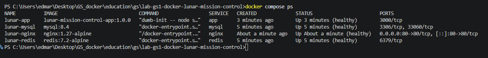
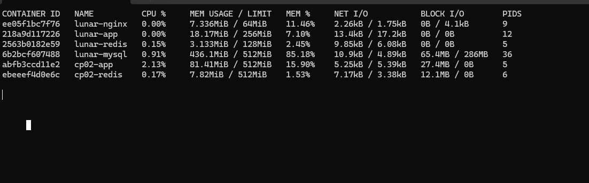
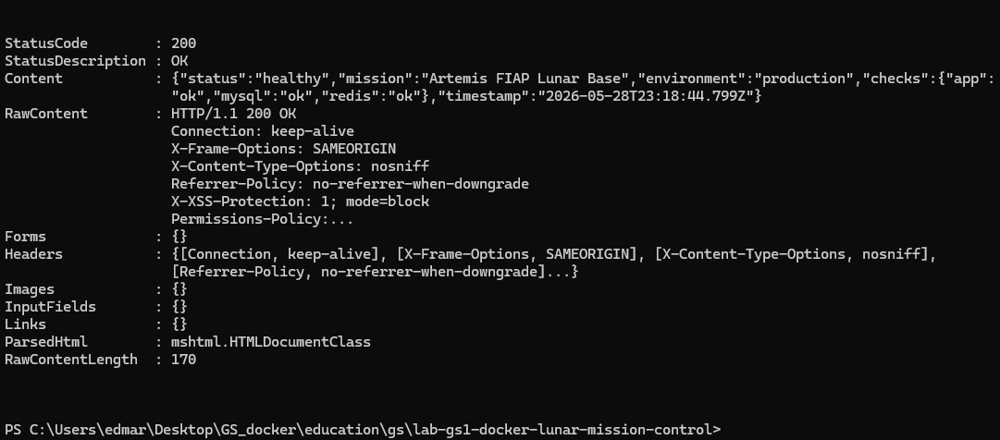
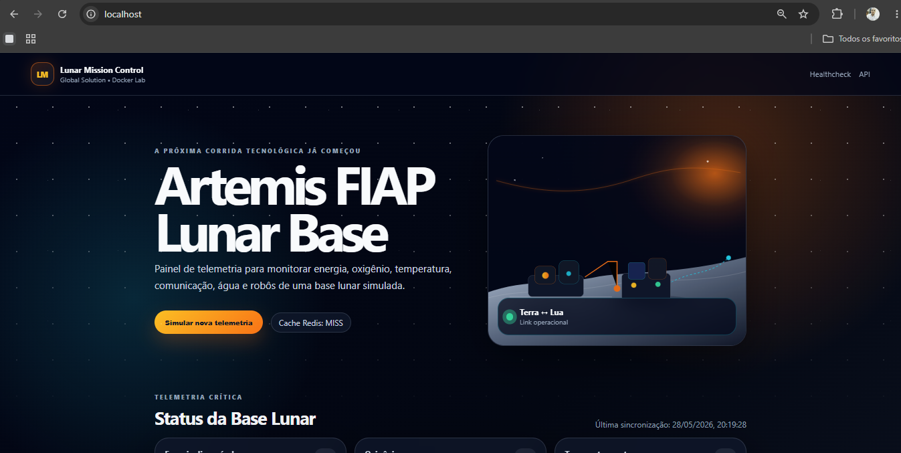

# Global Solution — Lunar Mission Control


## Contexto

Aplicação Node.js que simula um painel de monitoramento de uma base lunar, exibindo energia, oxigênio, temperatura, comunicação com a Terra, estoque de água e status dos robôs.

Esta entrega cobre **todas as melhorias de infraestrutura Docker** exigidas na avaliação, incluindo o item plus de **verificação de CVEs com Trivy**.

---

## Arquitetura de Produção

```
Internet
    │
    ▼
[Nginx 1.27-alpine]  ←── único ponto de entrada (porta 80)
    │
    ▼  (rede interna lunar-network — sem portas expostas ao host)
[Node.js app]  ──→  [MySQL 8.4]
      └──────────→  [Redis 7.2-alpine]
```

| Serviço    | Imagem              | Função                        |
|------------|---------------------|-------------------------------|
| nginx      | nginx:1.27-alpine   | Reverse proxy / ingress       |
| app        | (build local)       | API + frontend Node.js        |
| mysql      | mysql:8.4           | Banco de dados de telemetria  |
| redis      | redis:7.2-alpine    | Cache de 15 s da API          |
| init-media | busybox:1.36        | Seed do volume de mídia (one-shot) |

---

## O que foi melhorado

### 1. Dockerfile

| Antes | Depois |
|---|---|
| `node:latest` | `node:20-alpine` (versão fixada, imagem ~55 MB) |
| Single-stage | Multi-stage build (deps → runner) |
| Rodava como root | Usuário `node` (non-root) |
| Sem init process | `dumb-init` garante SIGTERM correto |
| Sem HEALTHCHECK | `HEALTHCHECK` via `/health` com retries |
| Sem `.dockerignore` | `.dockerignore` exclui `.git`, `node_modules`, `.env`, docs |

### 2. docker-compose.yml

| Antes | Depois |
|---|---|
| Tags `latest` em tudo | Versões fixadas em todos os serviços |
| Senhas hardcoded | Lidas do `.env` via interpolação `${VAR}` |
| `depends_on` simples | `depends_on` com `condition: service_healthy` |
| Sem healthchecks | Healthcheck em todos os serviços |
| Portas 3306 e 6379 expostas ao host | Portas internas apenas (segurança) |
| Sem redes explícitas | Rede isolada `lunar-network` (bridge) |
| Sem limites de recursos | `deploy.resources` com `limits` e `reservations` |
| Sem logging | `json-file` com rotação (`max-size 10m`, `max-file 3`) |
| Sem volume MySQL | Volume `lunar_mysql_data` para persistência |

### 3. Gestão de containers

- `restart: unless-stopped` em todos os serviços persistentes
- `init-media` com `restart: "no"` (run-once)
- Ordem correta de inicialização via health conditions
- Resource limits evitam starvation de recursos na EC2

### 4. Segurança

- Nenhuma senha hardcoded no `docker-compose.yml`
- `.env` com senhas fortes (mínimo 20 chars, símbolos, dígitos)
- MySQL e Redis **não** publicam portas para o host
- Container da app roda como usuário `node` (UID 1000), não root
- Nginx com headers: `X-Frame-Options`, `X-Content-Type-Options`, `X-XSS-Protection`, `Permissions-Policy`
- Rate limiting na Nginx: 30 req/min por IP para `/api/`
- `.dockerignore` impede que `.env` seja copiado para a imagem

### 5. Volumes e Networks

- `lunar_mysql_data` — persiste dados do MySQL entre restarts
- `lunar_media_data` — volume compartilhado entre `init-media`, `app` e `nginx`
- Rede `lunar-network` isola os serviços; somente Nginx expõe porta ao host

### 6. Nginx melhorado

- **Gzip**: compressão de JSON, JS, CSS e SVG
- **Rate limiting**: `limit_req_zone` protege a API
- Headers de segurança adicionais
- Healthcheck interno `/nginx-health`

---

## Itens Plus

### 1. Vulnerabilidade — CVE Scanning com Trivy

O arquivo [docker-compose.scan.yml](docker-compose.scan.yml) executa o scanner [Trivy](https://trivy.dev) da Aqua Security contra a imagem construída, reportando CVEs de severidade **HIGH** e **CRITICAL**.

```bash
# Buildar imagem e escanear
make scan

# Relatório salvo em:
trivy-results/trivy-report.txt
```

---

### 2. Observabilidade — Prometheus + Grafana + cAdvisor

Stack de monitoramento completa no arquivo [docker-compose.observability.yml](docker-compose.observability.yml).

| Serviço    | Imagem                          | Função                              | Porta |
|------------|---------------------------------|-------------------------------------|-------|
| cadvisor   | gcr.io/cadvisor/cadvisor:v0.49.1| Métricas de CPU/RAM de containers   | -     |
| prometheus | prom/prometheus:v2.51.2         | Coleta e armazena métricas          | 9090  |
| grafana    | grafana/grafana:10.4.2          | Dashboards de visualização          | 3001  |

```bash
# Subir observabilidade (stack principal deve estar rodando)
make obs-up

# Acessar
# Prometheus : http://IP_EC2:9090
# Grafana    : http://IP_EC2:3001  → admin / LunarGrafana@2025

# Parar
make obs-down
```

No Grafana, importe o dashboard **cAdvisor** (ID `14282`) para visualizar métricas de todos os containers da stack lunar em tempo real.

---

### 3. Image Registry — AWS ECR

Publicação da imagem no **Elastic Container Registry (ECR)** da AWS.

**Pré-requisito:** configurar `AWS_ACCOUNT_ID` e `AWS_REGION` no `.env` e ter o AWS CLI configurado na EC2 com permissões ECR.

```bash
# 1. Criar o repositório no ECR (só na primeira vez)
make ecr-create-repo

# 2. Buildar, autenticar e publicar
make ecr-push

# Imagem publicada em:
# <ACCOUNT_ID>.dkr.ecr.<REGION>.amazonaws.com/lunar-mission-control-app:1.0.0
```

Para usar a imagem do ECR na stack em vez do build local, substitua no `docker-compose.yml`:
```yaml
app:
  image: ${AWS_ACCOUNT_ID}.dkr.ecr.${AWS_REGION}.amazonaws.com/lunar-mission-control-app:1.0.0
```

---

## Como subir a stack

### Pré-requisitos

- Docker Engine ≥ 24.x
- Docker Compose plugin v2.x
- (EC2) Security Group com porta 80 aberta

### Deploy na EC2

```bash
# 1. Clonar o repositório
git clone https://github.com/pauloferrari-prs/education.git
cd education/gs/lab-gs1-docker-lunar-mission-control

# 2. (Opcional) Ajustar senhas no .env

# 3. Subir a stack
make up
# ou: docker compose up -d --build
```

### Verificar a stack

```bash
# Status dos containers
make ps
# ou: docker compose ps

# Métricas de CPU/memória em tempo real
make stats
# ou: docker stats

# Testar healthchecks
make health
# ou:
curl -s http://localhost/health | jq
curl -s http://localhost/ready  | jq

# Acessar a aplicação
curl http://localhost
```

---

## Endpoints

| Método | Path           | Descrição                        |
|--------|----------------|----------------------------------|
| GET    | `/`            | Interface web do painel lunar    |
| GET    | `/api/status`  | Dados de telemetria (com cache)  |
| POST   | `/api/simulate`| Simula nova leitura de telemetria|
| GET    | `/health`      | Healthcheck geral (app+db+cache) |
| GET    | `/ready`       | Readiness probe                  |
| GET    | `/nginx-health`| Healthcheck interno do Nginx     |

---

## Makefile — comandos disponíveis

```bash
# Stack principal
make up            # Sobe a stack (build + detached)
make down          # Para e remove containers
make build         # Rebuild forçado (--no-cache)
make restart       # Reinicia todos os serviços
make ps            # Lista containers e status
make logs          # Tail dos logs de todos os serviços
make stats         # docker stats ao vivo
make health        # Chama /health e /ready

# Item Plus: Observabilidade
make obs-up        # Sobe Prometheus + Grafana + cAdvisor
make obs-down      # Para a stack de observabilidade
make obs-logs      # Logs da observabilidade

# Item Plus: CVE Scanning
make scan          # Build + scan CVE com Trivy

# Item Plus: ECR
make ecr-create-repo  # Cria repositório no ECR (primeira vez)
make ecr-push         # Build + login AWS + tag + push para ECR

# Cleanup
make clean         # Down + remove volumes
make prune         # docker system prune -a (CUIDADO)
```

---

## Arquivos do projeto

```
.
├── Dockerfile                       # Multi-stage, alpine, non-root, healthcheck
├── docker-compose.yml               # Stack de produção
├── docker-compose.observability.yml # Item Plus: Prometheus + Grafana + cAdvisor
├── docker-compose.scan.yml          # Item Plus: CVE scan com Trivy
├── .env                             # Credenciais (não commitar em repos públicos reais)
├── .env.example                     # Template de variáveis
├── .dockerignore                    # Exclui arquivos desnecessários da imagem
├── Makefile                         # Atalhos: up, obs-up, scan, ecr-push, stats...
├── nginx/
│   └── default.conf                 # Reverse proxy + gzip + rate limiting + security headers
├── observability/
│   ├── prometheus.yml               # Jobs de scraping (cAdvisor + health probes)
│   └── grafana/
│       ├── datasources/
│       │   └── prometheus.yaml      # Auto-provisioning do datasource
│       └── dashboards/
│           └── dashboards.yaml      # Provider de dashboards
├── src/
│   └── server.js                    # Aplicação Node.js (não modificado)
├── public/                          # Frontend estático
├── media/                           # SVGs seedados no volume
└── trivy-results/                   # Relatórios de CVE (gerado pelo scan)
```

---

## Evidências de execução

### `docker compose ps` — todos os containers healthy



### `docker stats` — uso de CPU e memória com limites aplicados



### `curl /health` — todos os checks ok (app, mysql, redis)



> Nota: o output do PowerShell mostra também os headers de segurança do Nginx
> (`X-Frame-Options`, `X-Content-Type-Options`, `X-XSS-Protection`, `Permissions-Policy`).

### Aplicação no navegador — `http://localhost/`



---

## Limpeza

```bash
# Parar e remover containers + volumes
docker compose down -v

# Purge completo do Docker (cuidado em produção)
docker system prune -a --volumes -f
```
